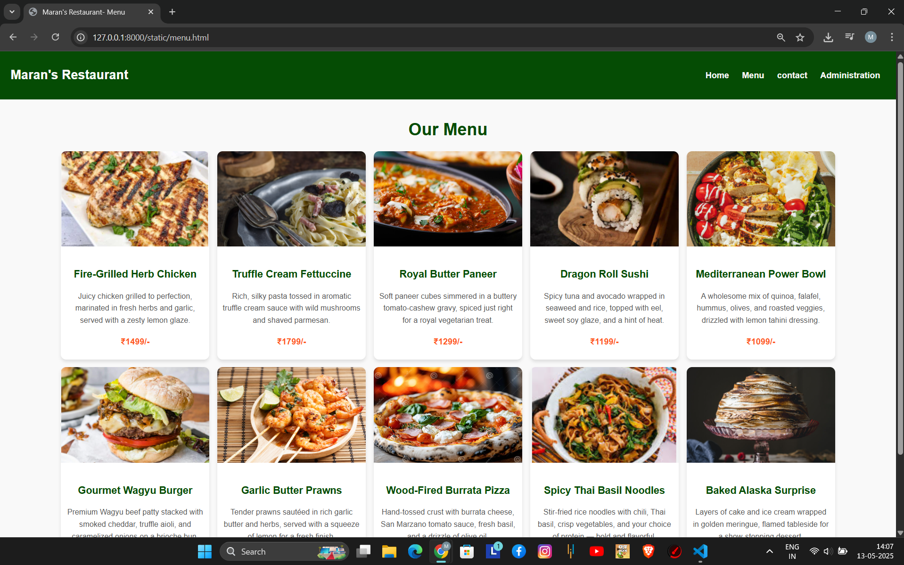
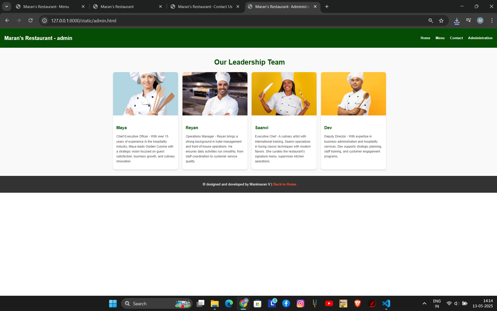

# Ex.07 Restaurant Website
## Reg.no:212224220060
## Date:12.05.2025

## AIM:
To develop a static Restaurant website to display the food items and services provided by them.

## DESIGN STEPS:

### Step 1:
Requirement collection.

### Step 2:
Creating the layout using HTML and CSS.

### Step 3:
Updating the sample content.

### Step 4:
Choose the appropriate style and color scheme.

### Step 5:
Validate the layout in various browsers.

### Step 6:
Validate the HTML code.

### Step 7:
Publish the website in the given URL.

## PROGRAM:
### home.html:
```
<!DOCTYPE html>
<html lang="en">
<head>
    <meta charset="UTF-8">
    <meta name="viewport" content="width=device-width, initial-scale=1.0">
    <title>Maran's Restaurant</title>
    <style>
      
        body {
            margin: 0;
            font-family: 'Arial', sans-serif;
            line-height: 1.6;
            color: #333;
            box-sizing: border-box;
        }

        *, *::before, *::after {
            box-sizing: inherit;
        }

        header {
            background: #054c04;
            color: #333;
            padding: 10px 20px;
            display: flex;
            align-items: center;
            justify-content: space-between;
            box-shadow: 0 4px 6px rgba(0, 0, 0, 0.1);
        }

        header img {
            height: 40px;
        }

        header nav a {
            text-decoration: none;
            color: #f9f9f9;
            font-weight: bold;
            margin: 0 10px;
            transition: color 0.3s ease;
        }

        header nav a:hover {
            color: #ff5722;
        }

        .banner {
            display: flex;
            align-items: center;
            justify-content: space-between;
            padding: 30px 20px;
            background: url('bg.png') no-repeat center center/cover;
            color: white;
            height: 300px;
            text-shadow: 0 2px 4px rgba(0, 0, 0, 0.8);
        }

        .banner-content {
            max-width: 50%;
        }

        .banner-content h1 {
            font-family: Georgia, 'Times New Roman', Times, serif;
            font-size: 2.5rem;
            margin-bottom: 10px;
            color: rgba(4, 13, 82, 0.121);
        }

        .banner-content p {
            font-size: 1rem;
            margin-bottom: 15px;
            color: white;
        }

        .banner-content a {
            background: #ff5622;
            color: white;
            padding: 8px 15px;
            text-decoration: none;
            font-weight: bold;
            border-radius: 5px;
            transition: background 0.3s ease;
        }

        .banner-content a:hover {
            background: #e64a19;
        }

        .features {
            display: flex;
            justify-content: space-between;
            align-items: flex-start;
            padding: 20px;
            gap: 15px;
            background: #f9f9f9;
        }

        .feature {
            background: white;
            border-radius: 10px;
            padding: 15px;
            box-shadow: 0 4px 6px rgba(0, 0, 0, 0.1);
            flex: 1;
            text-align: center;
        }

        .feature img {
            width: 100%;
            border-radius: 10px;
            margin-bottom: 10px;
        }

        .feature h3 {
            font-size: 1.2rem;
            margin-bottom: 10px;
            color: #1f1714;
        }

        .feature p {
            font-size: 0.9rem;
            color: white;
        }

        footer {
            background: #333;
            color: white;
            text-align: center;
            padding: 10px 0;
            margin-top: 10px;
        }

        footer a {
            color: #ff5722;
            text-decoration: none;
            font-weight: bold;
            transition: color 0.3s ease;
        }

        footer a:hover {
            color: #ffdd57;
        }

        @media (max-width: 768px) {
            .banner {
                flex-direction: column;
                height: auto;
                text-align: center;
            }

            .banner-content {
                max-width: 100%;
            }

            .features {
                flex-direction: column;
                gap: 20px;
            }

            .feature {
                flex: none;
            }

            header nav a {
                margin: 0 5px;
            }
        }
    </style>
</head>
<body>
      <header>
        
        <nav>
            <a href="home.html">Home</a>
            <a href="menu.html">Menu</a>
            <a href="contact.html">Contact</a>
            <a href="admin.html">Administration</a>
        </nav>
    </header>

    <div class="banner">
        <div class="banner-content">
            <h1>Welcome to Maran's Restaurant</h1>
            <p>A Celebration of Global Flavors, Where Taste Travels Beyond Borders</p>
            <a href="#features">Explore Now</a>
        </div>
    </div>

    <section id="features" class="features">
        <div class="feature">
            
            <h3>Fresh Ingredients</h3>
            <p>Freshness Focused: "Taste the freshness, enjoy the flavor".</p>
        </div>
        <div class="feature">
            
            <h3>Cozy Ambiance</h3>
            <p>The Perfect Place to Relax and Reconnect.</p>
        </div>
        <div class="feature">
            
            <h3>Easy Reservations</h3>
            <p>Reserve your seat and savor an unforgettable experience where fine dining meets flawless ambiance.</p>
        </div>
    </section>

    <footer>
        <p>&copy; Designed and developed by ManiMaran V| <a href="#">Privacy Policy</a></p>
    </footer>

</body>
</html>
```

### menu.html:
```
<!DOCTYPE html>
<html lang="en">
<head>
    <meta charset="UTF-8">
    <meta name="viewport" content="width=device-width, initial-scale=1.0">
    <title>Maran's Restaurant- Menu</title>
    <style>
        body {
            margin: 0;
            font-family: 'Arial', sans-serif;
            line-height: 1.6;
            color: #333;
            box-sizing: border-box;
        }

        *, *::before, *::after {
            box-sizing: inherit;
        }

        header {
            background: #054c04;
            color: #fff;
            padding: 10px 20px;
            display: flex;
            align-items: center;
            justify-content: space-between;
            box-shadow: 0 4px 6px rgba(0, 0, 0, 0.1);
        }

        header nav a {
            text-decoration: none;
            color: #f9f9f9;
            font-weight: bold;
            margin: 0 10px;
            transition: color 0.3s ease;
        }

        header nav a:hover {
            color: #ffdd57;
        }

        header h1 {
            font-size: 1.5rem;
        }

        .menu-container {
            padding: 10px;
            background: #f9f9f9;
            text-align: center;
        }

        .menu-container h1 {
            font-size: 2rem;
            color: #054c04;
            margin-bottom: 15px;
        }

        .menu-items {
            display: flex;
            flex-wrap: wrap;
            gap: 15px;
            justify-content: center;
        }

        .menu-item {
            background: white;
            border-radius: 10px;
            box-shadow: 0 4px 6px rgba(0, 0, 0, 0.1);
            width: 280px;
            overflow: hidden;
            transition: transform 0.3s ease;
        }

        .menu-item img {
            width: 100%;
            height: 180px;
            object-fit: cover;
        }

        .menu-item:hover {
            transform: scale(1.05);
        }

        .menu-details {
            padding: 10px;
        }

        .menu-details h3 {
            font-size: 1.2rem;
            color: #054c04;
            margin-bottom: 8px;
        }

        .menu-details p {
            font-size: 0.9rem;
            color: #555;
            margin-bottom: 10px;
        }

        .menu-details .price {
            font-weight: bold;
            font-size: 1rem;
            color: #ff5722;
        }

        footer {
            background: #333;
            color: white;
            text-align: center;
            padding: 10px 0;
            margin-top: 10px;
        }

        footer a {
            color: #ff5722;
            text-decoration: none;
            font-weight: bold;
            transition: color 0.3s ease;
        }

        footer a:hover {
            color: #ffdd57;
        }

        @media (max-width: 768px) {
            header h1 {
                font-size: 1.2rem;
            }

            .menu-items {
                flex-direction: column;
                gap: 20px;
            }

            .menu-item {
                width: 100%;
            }

            header nav a {
                margin: 0 5px;
            }
        }
    </style>
</head>
<body>

    <header>
        <h1>Maran's Restaurant</h1>
        <nav>
            <a href="home.html">Home</a>
            <a href="menu.html">Menu</a>
            <a href="contact.html">contact</a>
            <a href="admin.html">Administration</a>
        </nav>
    </header>

    <div class="menu-container">
        <h1>Our Menu</h1>
        <div class="menu-items">
            <div class="menu-item">
                
                <div class="menu-details">
                    <h3>Fire-Grilled Herb Chicken</h3>
                    <p>Juicy chicken grilled to perfection, marinated in fresh herbs and garlic, served with a zesty lemon glaze.</p>
                    <p class="price">₹1499/-</p>
                </div>
            </div>

            <div class="menu-item">
                
                <div class="menu-details">
                    <h3>Truffle Cream Fettuccine</h3>
                    <p>Rich, silky pasta tossed in aromatic truffle cream sauce with wild mushrooms and shaved parmesan.</p>
                    <p class="price">₹1799/-</p>
                </div>
            </div>

            <div class="menu-item">
                
                <div class="menu-details">
                    <h3>Royal Butter Paneer</h3>
                    <p>Soft paneer cubes simmered in a buttery tomato-cashew gravy, spiced just right for a royal vegetarian treat.</p>
                    <p class="price">₹1299/-</p>
                </div>
            </div>

            <div class="menu-item">
                
                <div class="menu-details">
                    <h3>Dragon Roll Sushi</h3>
                    <p>Spicy tuna and avocado wrapped in seaweed and rice, topped with eel, sweet soy glaze, and a hint of heat.</p>
                    <p class="price">₹1199/-</p>
                </div>
            </div>

            <div class="menu-item">
                
                <div class="menu-details">
                    <h3>Mediterranean Power Bowl</h3>
                    <p>A wholesome mix of quinoa, falafel, hummus, olives, and roasted veggies, drizzled with lemon tahini dressing.</p>
                    <p class="price">₹1099/-</p>
                </div>
            </div>

            <div class="menu-item">
                
                <div class="menu-details">
                    <h3>Gourmet Wagyu Burger</h3>
                    <p> Premium Wagyu beef patty stacked with smoked cheddar, truffle aioli, and caramelized onions on a brioche bun.</p>
                    <p class="price">₹2299/-</p>
                </div>
            </div>

            <div class="menu-item">
                
                <div class="menu-details">
                    <h3>Garlic Butter Prawns</h3>
                    <p>Tender prawns sautéed in rich garlic butter and herbs, served with a squeeze of lemon for a fresh finish.</p>
                    <p class="price">₹1799/-</p>
                </div>
            </div>


            <div class="menu-item">
                
                <div class="menu-details">
                    <h3>Wood-Fired Burrata Pizza</h3>
                    <p>Hand-tossed crust with burrata cheese, San Marzano tomato sauce, fresh basil, and a drizzle of olive oil.</p>
                    <p class="price">₹1499/-</p>
                </div>
            </div>


            <div class="menu-item">
                
                <div class="menu-details">
                    <h3>Spicy Thai Basil Noodles</h3>
                    <p>Stir-fried rice noodles with chili, Thai basil, crisp vegetables, and your choice of protein — bold and flavorful.</p>
                    <p class="price">₹1399/-</p>
                </div>
            </div>


            <div class="menu-item">
                
                <div class="menu-details">
                    <h3>Baked Alaska Surprise</h3>
                    <p>Layers of cake and ice cream wrapped in golden meringue, flamed tableside for a show-stopping dessert.</p>
                    <p class="price">₹999/-</p>
                </div>
            </div>
         </div>
    </div>

    <footer>
        <p>&copy; designed and developed by Manimaran V | <a href="home.html">Back to Home</a></p>
    </footer>

</body>
</html>
```
### admin.html:
```
<!DOCTYPE html>
<html lang="en">
<head>
    <meta charset="UTF-8">
    <meta name="viewport" content="width=device-width, initial-scale=1.0">
    <title>Maran's Restaurant- Administration</title>
    <style>
        body {
            margin: 0;
            font-family: 'Arial', sans-serif;
            line-height: 1.6;
            color: #333;
            box-sizing: border-box;
        }

        *, *::before, *::after {
            box-sizing: inherit;
        }

        header {
            background: #054c04;
            color: #fff;
            padding: 10px 20px;
            display: flex;
            align-items: center;
            justify-content: space-between;
            box-shadow: 0 4px 6px rgba(0, 0, 0, 0.1);
        }

        header nav a {
            text-decoration: none;
            color: #f9f9f9;
            font-weight: bold;
            margin: 0 10px;
            transition: color 0.3s ease;
        }

        header nav a:hover {
            color: #ffdd57;
        }

        header h1 {
            font-size: 1.5rem;
        }

        .admin-container {
            padding: 20px;
            background: #f9f9f9;
            text-align: center;
        }

        .admin-container h1 {
            font-size: 2rem;
            color: #054c04;
            margin-bottom: 20px;
        }

        .admin-items {
            display: flex;
            flex-wrap: wrap;
            gap: 20px;
            justify-content: center;
        }

        .admin-item {
            background: white;
            border-radius: 10px;
            box-shadow: 0 4px 6px rgba(0, 0, 0, 0.1);
            width: 300px;
            overflow: hidden;
            transition: transform 0.3s ease;
            text-align: left;
        }

        .admin-item img {
            width: 100%;
            height: 200px;
            object-fit: cover;
        }

        .admin-item:hover {
            transform: scale(1.05);
        }

        .admin-details {
            padding: 15px;
        }

        .admin-details h3 {
            font-size: 1.2rem;
            color: #054c04;
            margin-bottom: 8px;
        }

        .admin-details p {
            font-size: 0.9rem;
            color: #555;
            margin-bottom: 10px;
        }

        footer {
            background: #333;
            color: white;
            text-align: center;
            padding: 10px 0;
            margin-top: 10px;
        }

        footer a {
            color: #ff5722;
            text-decoration: none;
            font-weight: bold;
            transition: color 0.3s ease;
        }

        footer a:hover {
            color: #ffdd57;
        }

        @media (max-width: 768px) {
            header h1 {
                font-size: 1.2rem;
            }

            .admin-items {
                flex-direction: column;
                gap: 20px;
            }

            .admin-item {
                width: 100%;
            }

            header nav a {
                margin: 0 5px;
            }
        }
    </style>
</head>
<body>

    <header>
        <h1>Maran's Restaurant - admin</h1>
        <nav>
            <a href="home.html">Home</a>
            <a href="menu.html">Menu</a>
            <a href="contact.html">Contact</a>
            <a href="admin.html">Administration</a>
        </nav>
    </header>

   <div class="admin-container">
      <h1>Our Leadership Team</h1>
      <div class="admin-items">
          <div class="admin-item">
              
              <div class="admin-details">
                  <h3>Maya</h3>
                  <p>Chief Executive Officer - With over 15 years of experience in the hospitality industry, Maya leads Golden Cuisine with a strategic vision focused on guest satisfaction, business growth, and culinary innovation.</p>
              </div>
          </div>

          <div class="admin-item">
              
              <div class="admin-details">
                  <h3>Reyan</h3>
                  <p>Operations Manager - Reyan brings a strong background in hotel management and front-of-house operations. He ensures daily activities run smoothly, from staff coordination to customer service quality. </p>
              </div>
          </div>

          <div class="admin-item">
              
              <div class="admin-details">
                  <h3>Saanvi</h3>
                  <p>Executive Chef - A culinary artist with international training, Saanvi specializes in fusing classic techniques with modern flavors. She curates the restaurant’s signature menu, supervises kitchen operations.</p>
              </div>
          </div>

          <div class="admin-item">
              
              <div class="admin-details">
                  <h3>Dev</h3>
                  <p>Deputy Director - With expertise in business administration and hospitality services, Dev supports strategic planning, staff training, and customer engagement programs.</p>
             </div>
          </div>
      </div>
  </div>
     <footer>
        <p>&copy; designed and developed by Manimaran V | <a href="home.html">Back to Home</a></p>
    </footer>

</body>
</html>
```
### contact.html
```
<!DOCTYPE html>
<html lang="en">
<head>
    <meta charset="UTF-8">
    <meta name="viewport" content="width=device-width, initial-scale=1.0">
    <title>Maran's Restaurant- Contact Us</title>
    <style>
        body {
            margin: 0;
            font-family: 'Arial', sans-serif;
            line-height: 1.6;
            color: #333;
            box-sizing: border-box;
        }

        *, *::before, *::after {
            box-sizing: inherit;
        }

        header {
            background: #054c04;
            color: #333;
            padding: 15px 30px;
            display: flex;
            align-items: center;
            justify-content: space-between;
            box-shadow: 0 4px 6px rgba(0, 0, 0, 0.1);
        }

        header img {
            height: 50px;
        }

        header nav a {
            text-decoration: none;
            color: #f9f9f9;
            font-weight: bold;
            margin: 0 10px;
            transition: color 0.3s ease;
        }

        header nav a:hover {
            color: #ff5722;
        }

        .contact-banner {
            display: flex;
            align-items: center;
            justify-content: center;
            background: url('cntbg.png') no-repeat center center/cover;
            height: 300px;
            text-shadow: 0 2px 4px rgba(0, 0, 0, 0.8);
        }

        .contact-banner h1 {
            font-family: Georgia, 'Times New Roman', Times, serif;
            font-size: 2.5rem;
            color: #f9f9f9;
        }

        .contact-section {
            display: flex;
            flex-wrap: wrap;
            justify-content: center;
            padding: 30px 15px;
            background: #f9f9f9;
            gap: 20px;
        }

        .contact-details, .contact-form {
            flex: 1;
            max-width: 500px;
            margin: 10px;
            background: white;
            padding: 20px;
            border-radius: 10px;
            box-shadow: 0 4px 6px rgba(0, 0, 0, 0.1);
        }

        .contact-details h2, .contact-form h2 {
            font-size: 1.8rem;
            margin-bottom: 15px;
            color: #1f1714;
            text-align: center;
        }

        .contact-details p {
            margin: 10px 0;
            font-size: 1rem;
            color: #555;
        }

        .contact-details img {
            max-width: 100%;
            border-radius: 10px;
            margin-bottom: 20px;
        }

        .contact-form input, .contact-form textarea {
            width: 100%;
            padding: 10px;
            margin: 10px 0;
            border: 1px solid #ccc;
            border-radius: 5px;
            font-size: 1rem;
        }

        .contact-form textarea {
            height: 100px;
        }

        .contact-form button {
            width: 100%;
            padding: 10px;
            background: #ff5722;
            color: white;
            font-size: 1.1rem;
            border: none;
            border-radius: 5px;
            cursor: pointer;
            transition: background 0.3s ease;
        }

        .contact-form button:hover {
            background: #e64a19;
        }

        footer {
            background: #333;
            color: white;
            text-align: center;
            padding: 15px 0;
        }

        footer a {
            color: #ff5722;
            text-decoration: none;
            font-weight: bold;
            transition: color 0.3s ease;
        }

        footer a:hover {
            color: #ffdd57;
        }

        @media (max-width: 768px) {
            .contact-details, .contact-form {
                max-width: 100%;
            }

            .contact-banner h1 {
                font-size: 2rem;
            }
        }
    </style>
</head>
<body>

    <header>
        
        <nav>
            <a href="home.html">Home</a>
            <a href="menu.html">Menu</a>
            <a href="contact.html">Contact</a>
            <a href="admin.html">Administration</a>
        </nav>
    </header>

    <div class="contact-banner">
     
    </div>

    <section class="contact-section">
        <div class="contact-details">
            <h2>Get in Touch</h2>
            
            <p><strong>Address:</strong> Maran's Restaurant,Yelagiri hills,tirupattur,Tamilnadu,India</p>
            <p><strong>Phone:</strong> +91 9834455778</p>
            <p><strong>Email:</strong> contact@maran.com</p>
            <p><strong>Hours:</strong> Mon-Sat: 10.00am -11:00 pm</p>
        </div>

        <div class="contact-form">
            <h2>Send Us a Message</h2>
            <form action="/submit-contact" method="POST">
                <label for="name">Full Name</label>
                <input type="text" id="name" name="name" placeholder="Enter your full name" required>

                <label for="email">Email Address</label>
                <input type="email" id="email" name="email" placeholder="Enter your email address" required>
         
                <label for="phone no">Phone Number</label>
                <input type="phone no" id="phone no" name="phone no" placeholder="Enter your phone number" required>

                <label for="message">Message</label>
                <textarea id="message" name="message" placeholder="Your message" required></textarea>

                <button type="submit">Send Message</button>
            </form>
        </div>
    </section>

    <footer>
        <p>&copy; designed and by developed by Manimaran V | <a href="#">Privacy Policy</a></p>
    </footer>

</body>
</html>
```

## OUTPUT:





## RESULT:
The program for designing software company website using HTML and CSS is completed successfully.
